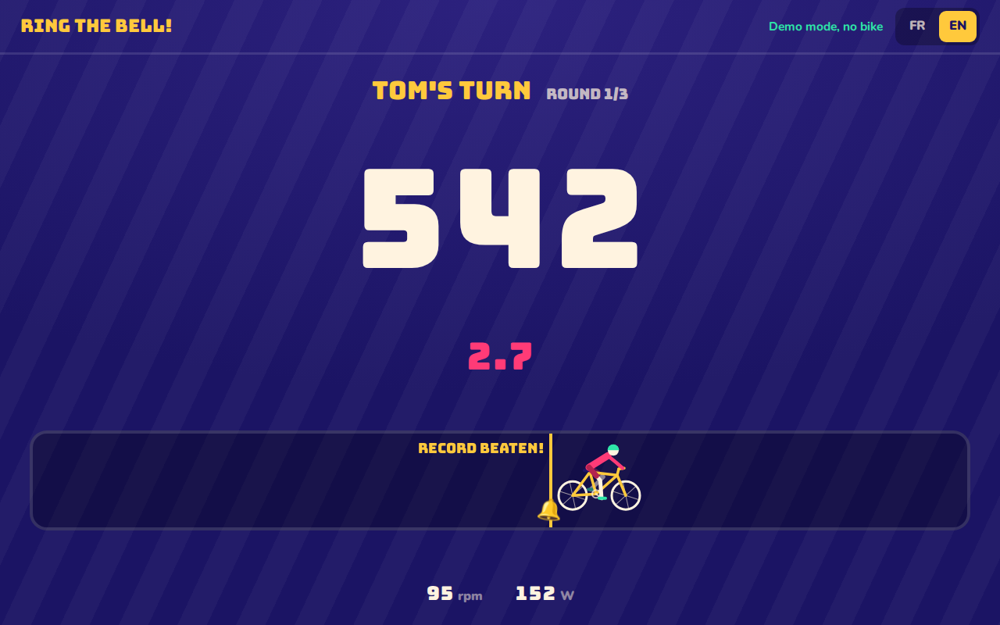
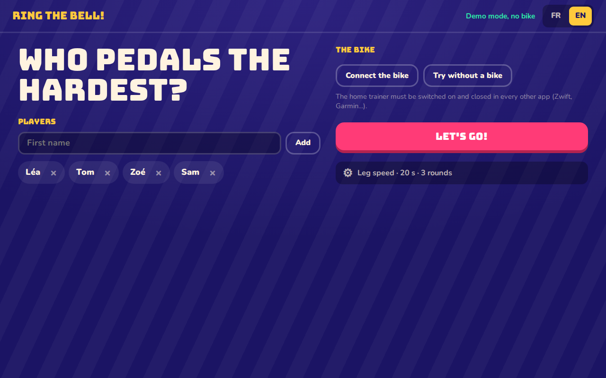
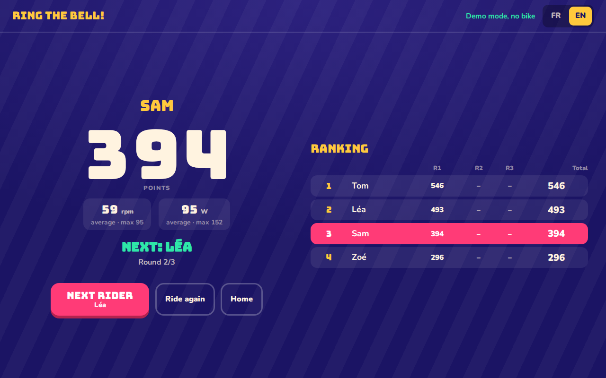
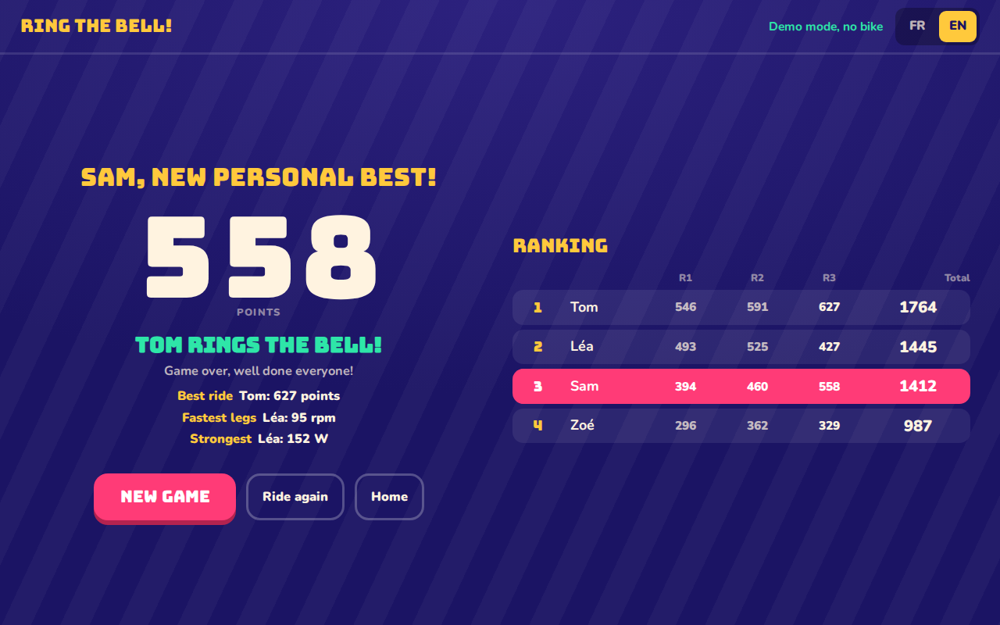

# Sonne la cloche !

A pedaling game made for a kids' birthday party: a child's bike on a smart
home trainer, one tablet or TV, and each kid gets 20 to 45 seconds to pedal as
fast as they can. The score counts pedal turns rather than watts, so the
smallest kids have as much of a chance as the tallest.

It runs in the browser, reads the trainer over Bluetooth, and works in French
(`/fr/`) and English (`/en/`).

**Play it at <https://sonnelacloche.enavarro.eu/>** (Chrome or Edge; no bike
needed to try it, see _Try without a bike_ below).



## How a game goes

Everyone rides once per round, for 3 to 5 rounds. The bell on the track marks
the best ride so far; pass it and it rings. On the very first ride there is no
record yet, so the bell marks a goal instead (80 rpm held for the whole ride).

After each ride you get the points, the average and peak cadence and power,
and a table of every round so far. At the end, the winner rings the bell, and
three awards go to the best single ride, the fastest legs and the strongest
rider.

| Before the game                           | After a ride                                 | End of the game                                  |
| ----------------------------------------- | -------------------------------------------- | ------------------------------------------------ |
|  |  |  |

Players and settings are remembered: for the next game, connect the bike and
hit _Let's go!_

At the end, _Share_ sends an image of the results to WhatsApp, Signal and the
like, and _Strava_ shows a QR code per player: it opens their game on their
phone, to publish it on their Strava account (as an indoor or virtual ride) or
download it as a `.fit` file. The game data travels inside the QR code; nothing
is stored on a server.

## What you need

- A home trainer or sensor that speaks Bluetooth **FTMS**, **Cycling Power**
  or **CSC** (speed/cadence). Close every other app that could hold it (Zwift,
  the vendor app, a Garmin watch): only one connection at a time.
- **Chrome or Edge**, on a computer or an Android tablet. Safari, Firefox and
  iOS don't support Web Bluetooth.
- **HTTPS** (or `localhost`): browsers only allow Bluetooth on secure pages.
- For young kids: put the bike in its smallest gear and the trainer at minimum
  resistance, or their legs give up after ten seconds.

No trainer at hand? _Try without a bike_, then hold the on-screen button (or
Space) to pedal.

## Run it

```sh
pnpm install
pnpm dev          # http://localhost:5173, redirects to /fr/ or /en/
pnpm build        # static site in dist/ (/, /fr/, /en/), no server needed
```

## Strava publishing (optional)

Publishing needs the small service in `server/` (Python standard library
only): Strava's OAuth requires a client secret that cannot live in a web page.
It exchanges the authorization, uploads the file, sets the activity type and
revokes the access right away. It reads `STRAVA_CLIENT_ID`,
`STRAVA_CLIENT_SECRET` and `STRAVA_REDIRECT_URI` from its environment, and
expects `/api/strava/` of the game's domain to be proxied to it. Without it, the
`.fit` download still works.

## Develop

```sh
pnpm check        # format check + lint + typecheck + unit tests + e2e
pnpm test         # unit tests (Vitest)
pnpm e2e          # end-to-end tests (Playwright, tablet and desktop screens)
pnpm test:server  # tests of the Strava service (Python)
```

First e2e run: `pnpm exec playwright install chromium`. `CLAUDE.md` describes
the architecture and the constraints to keep in mind.

## Troubleshooting

| Symptom                          | Most likely cause                                                |
| -------------------------------- | ---------------------------------------------------------------- |
| "Connect the bike" is greyed out | Browser without Web Bluetooth (Safari, Firefox, iOS) or no HTTPS |
| The trainer is not in the list   | Still connected to another app, or asleep                        |
| Connected but cadence stays at 0 | Power meter without crank data: switch the metric to "Strength"  |
| Values look doubled or empty     | FTMS parsing: see the note on bit 0 in `CLAUDE.md`               |

## License

[MIT](LICENSE), by [enavarro222](https://github.com/enavarro222).
